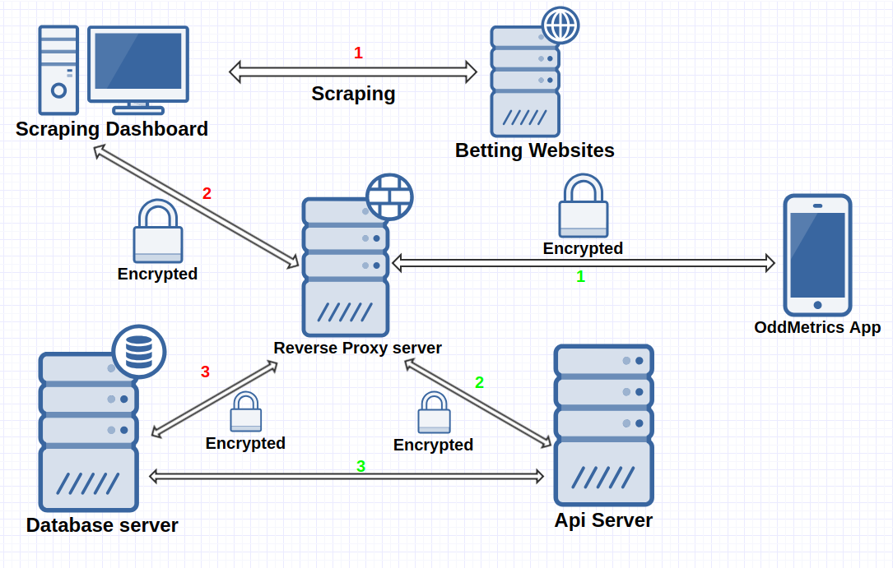
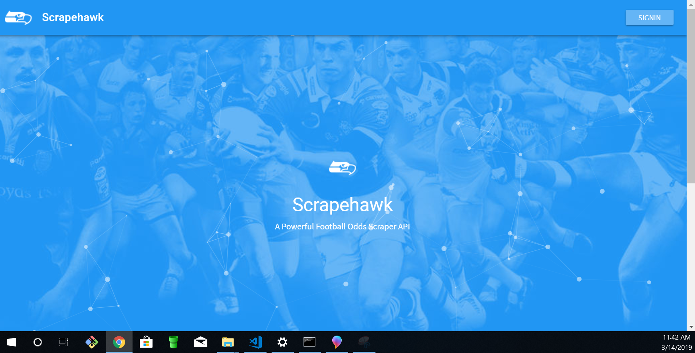
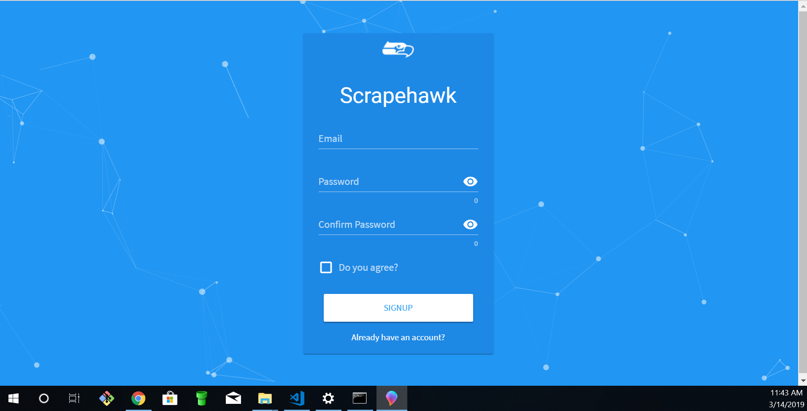
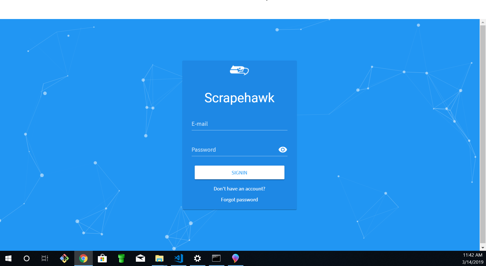
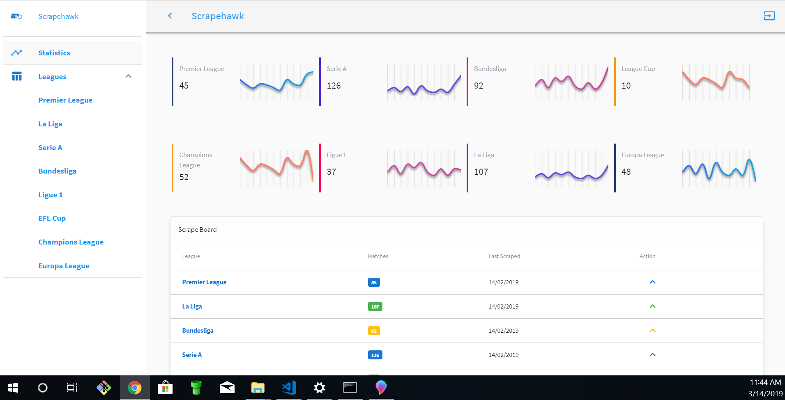
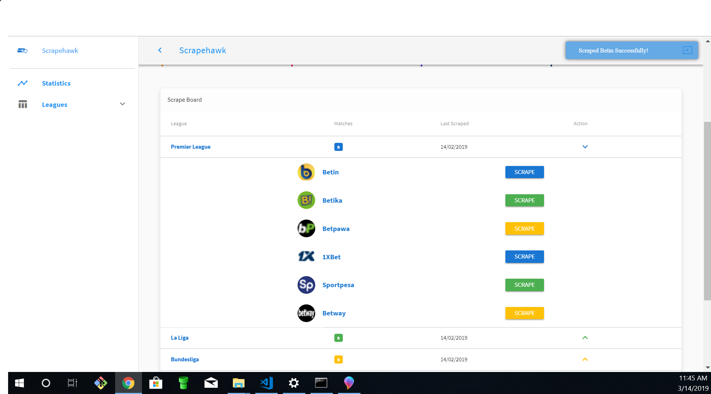

# OddScraperApi

[](https://badge.fury.io/js/npm)

Unleash the power within

> A versatile and powerful scraping engine for multiple betting sites. It scrapes odds for various games from the legitimate betting sites and stores them for use by clients via a restful API.

## Requirements

Install nodejs in your system

```bash
sudo apt-get update
sudo apt-get install build-essential libssl-dev
curl -o- https://raw.githubusercontent.com/creationix/nvm/v0.33.11/install.sh | bash
bash install_nvm.sh
source ~/.bashrc
```

or

```bash
sudo apt-get update
sudo apt-get install build-essential libssl-dev
wget -qO- https://raw.githubusercontent.com/creationix/nvm/v0.33.11/install.sh | bash
bash install_nvm.sh
source ~/.bashrc
```

## Verify nvm installation

```bash
command -v nvm
```

The above command should output `nvm` if the installation was successful. Please note that
`which nvm` will not work, since nvm is a sourced shell function, not an executable binary.

If you are having issues installing nvm you can check out the instructions at [creationix/nvm](https://github.com/creationix/nvm)

## Node installlation

If all went well.You should now be able to install nodejs.Note its preferable to use nodejs >=v8.0.

```bash
nvm ls-remote
nvm use v8.11.2
```

Please use the latest LTS version.

## Verify your node installation

```bash
node -v
```

Should output `v8.11.2`

## Usage

Just clone this repository, install dependencies and start application:

```bash
git clone https://github.com/basebandit/OddScraperApi.git
cd OddScraperApi
cd server
```

or

```bash
cd client
```

Then install all dependencies

```bash
npm install
npm start # with nodemon to monitor changes
```

## Configuration

For the api to work you have to set the following environment variables

- DATABASE_USER
- DATABASE_PASS
- DATABASE_PORT
- DATABASE_NAME
- DATABASE_HOST
- JWT_SECRET

## Optional

You can use the database dump which contains sample data for testing.
First create a database named scraper in your mongo instance. Then
import as shown here

```bash
mongorestore -d <database_name> <directory_backup>
```

## What's inside?

- [express.js](http://expressjs.com) framework
- [mongoose](https://github.com/Automattic/mongoose) Object Document Modelling middleware
- [mongodb](https://www.mongodb.com/) Flexible document storage software
- app configuration by [config](https://github.com/basebandit/NewsWallet/tree/master/config)
- endpoints schema validation by [hapijs/joi](https://github.com/hapijs/joi)
- all code is written ES5/ES6 supported features
- [npm scripts](https://github.com/basebandit/NewsWallet/blob/staging/package.json#L9) for task automation

## Play with the api

To test the api you can use `curl` or `postman` to make queries.

You can find the api documentation here `localhost:3333/api/v1/doc`

## Generate Api Documentation

To update the api documentation incase you have changed anything do like so

```bash
npm run doc
```

## Architecture




## Dashboard Screenshots

### Landing Screen



### Register Screen



### Login Screen



### Scrapehawk Scraping Dashboard



### Scrapehawk Dashboard

